# Exercise 1: Paper Eval

**Paper:** Perez-Almendros et al. (2020). *Don't Patronize Me! An Annotated Dataset with Patronizing and Condescending Language towards Vulnerable Communities.* COLING 2020.

---

## Q1 -- Primary Contributions

1. **The "Don't Patronize Me!" dataset.** 10,637 English news paragraphs (2010--2018; 20 countries) about 10 vulnerable communities, annotated for PCL at both paragraph level (binary + 5-point intensity scale) and span level (exact PCL segments with category labels). This fills a significant gap in the NLP resources landscape: prior work focused on hate speech and overt toxicity, whereas PCL is subtle and often well-intentioned, requiring a purpose-built corpus.

2. **A PCL taxonomy.** Seven fine-grained categories grouped into three high-level archetypes -- *The Saviour* (Unbalanced power, Compassion, Shallow solution), *The Expert* (Authority voice, Presupposition), and *The Poet* (Metaphors, Poorer the merrier) -- enabling both binary detection (Task 1) and category prediction (Task 2). The taxonomy moves the field beyond a single "PCL or not" label toward understanding the rhetorical mechanisms at play.

3. **Baseline experiments and SemEval competition.** The paper establishes SVM, BiLSTM, and fine-tuned BERT/RoBERTa/DistilBERT baselines across both tasks, and the dataset was subsequently used in SemEval-2022 Task 4, attracting 77 competing teams and generating a body of downstream research.

---

## Q2 -- Technical Strengths

- **Multi-layer annotation design.** The two-step process (paragraph-level scoring first, then span + category labelling only for confirmed PCL) is efficient and produces richer labels than a flat single-pass scheme. Using three expert annotators with diverse backgrounds (rather than crowd workers) is appropriate for a task requiring judgement about tone and social context. The final dataset retains all examples with mixed annotations (labels 1 and 2), preserving the inherent ambiguity of the phenomenon rather than discarding borderline cases.

- **Meaningful experimental breadth and error analysis.** Reporting precision, recall, and F1 across 10-fold CV for multiple model classes -- and breaking performance down by taxonomy category -- provides a realistic picture of where models succeed and fail. The qualitative discussion correctly identifies that some PCL categories (Authority voice, Metaphors, Poorer the merrier) require world knowledge to detect, which motivates the need for large pre-trained language models over feature-engineered systems.

- **Taxonomy coherence supported by data.** Our EDA (Section EDA 5) finds that the strongest category co-occurrence is between Unbalanced power relations and Shallow solution (r = 0.22), both belonging to *The Saviour* archetype. The three Saviour categories are also the three most frequent (72.1%, 47.2%, 19.7%), while Expert and Poet categories cluster at lower, similar frequencies. This validates the authors' grouping choice: the archetypes reflect genuine co-occurrence structure in the data, not an arbitrary partition.

---

## Q3 -- Key Weaknesses

- **Inter-annotator agreement is moderate and under-examined.** The paper reports paragraph-level Cohen's kappa of approximately 0.41, rising to ~0.61 only after removing borderline cases (labels 1--2). On the Landis & Koch scale, 0.41 is merely *moderate* agreement; a value above 0.60 is considered *substantial* and above 0.80 *almost perfect*. The paper does not adequately contextualise what these values mean for label quality or how they compare to similar subjective annotation tasks, leaving readers to judge the dataset's reliability without a clear benchmark. Some category-level agreements are notably low (e.g., Authority voice ~0.48), which directly limits how well any model can learn those categories. A more thorough adjudication procedure or explicit confidence weighting for low-agreement examples would have strengthened the resource.

- **Keyword-retrieval construction biases what "PCL" looks like.** All paragraphs were retrieved by querying for 10 fixed trigger words (homeless, refugee, women, etc.), which means the dataset conflates *topic* with *tone*. As our EDA confirms, PCL rates vary dramatically by keyword (2.8% for *immigrant* vs. 16.5% for *homeless*), reflecting how different communities are written about in English-language news rather than a balanced sample of PCL in general. A model trained on this data may learn to associate specific vocabulary with PCL rather than learning the underlying rhetorical phenomenon, and its real-world performance on PCL about communities or topics not present in the dataset is unknown. The paper does not discuss this retrieval bias or how it might limit generalisation.

# Exercise 2: Exploratory Data Analysis

## Dataset Overview

Each paragraph was retrieved by searching news articles for mentions of ten vulnerable-community keywords (disabled, homeless, hopeless, immigrant, in-need, migrant, poor-families, refugee, vulnerable, women). Two annotators independently rated each paragraph on a 0–4 scale; for Task 1, labels 0–1 are collapsed to **No-PCL (0)** and labels 2–4 to **PCL (1)**. In practice, the official test dataset does not have any examples of PCL label = 2, as this is an uncertain classification.

### Overall key findings
1. Large class imbalance: Must use F1 (positive class) as primary metric. Mitigate using weighted loss, oversampling or data augmentation.
2. 95% of texts have 102 words or fewer: Set `max_length = 128` for transformer tokenisers
3. Clear vocabulary divergence (TF-IDF): Can be used for baseline comparison

---

## EDA 1 — Class Distribution & Label Granularity

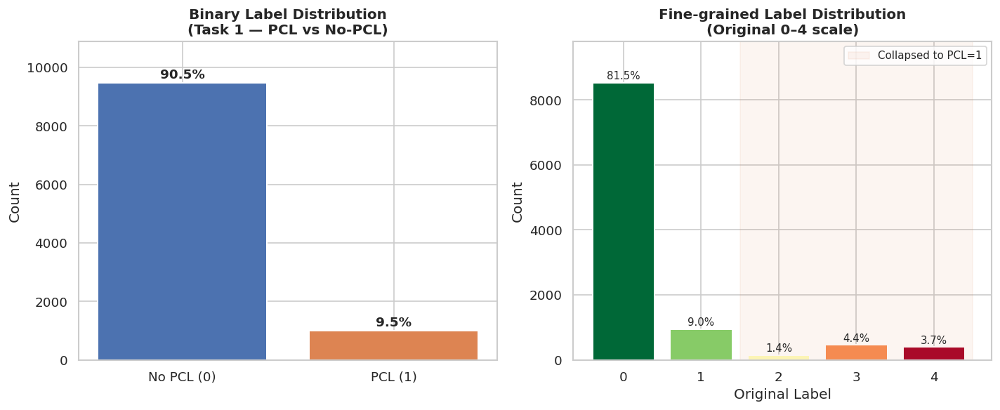

| Label | Description | Count | % |
|-------|-------------|------:|--:|
| 0 | No PCL | 9,476 | 90.5% |
| 1 | PCL | 993 | 9.5% |

Fine-grained breakdown (original 0–4 scale):

| Orig. label | Description | Count | % |
|-------------|-------------|------:|--:|
| 0 | Both annotators: No PCL | 8,529 | 81.5% |
| 1 | Mixed: No PCL / Borderline | 947 | 9.0% |
| 2 | Both annotators: Borderline PCL | 144 | 1.4% |
| 3 | Mixed: Borderline / Strong PCL | 458 | 4.4% |
| 4 | Both annotators: Strong PCL | 391 | 3.7% |

**Analysis:** The dataset is **severely imbalanced** at a 9.54:1 ratio (No-PCL to PCL), with only 993 PCL examples, a small dataset. This will be the central modelling challenge. I will be wary of overfitting during training and take advantage of pre-trained models for extra context and initial training values.

However, the fine-grained distribution reveals that the majority of PCL examples sit at labels 3 and 4 (strong / clear-cut PCL), with very few borderline cases at label 2 (only 1.4%). This means the binary collapse into the PCL class is dominated by unambiguous examples, which is advantageous for learning a clean decision boundary.

**Impact:** A naive majority-class classifier would achieve ~90.5% accuracy while predicting No-PCL for every sample, making accuracy a misleading metric. F1-score on the positive class must be the primary evaluation metric. Class imbalance mandates one or more mitigation strategies: weighted cross-entropy loss, oversampling PCL examples, or threshold tuning at inference time.

---

## EDA 2 — Text Length Analysis

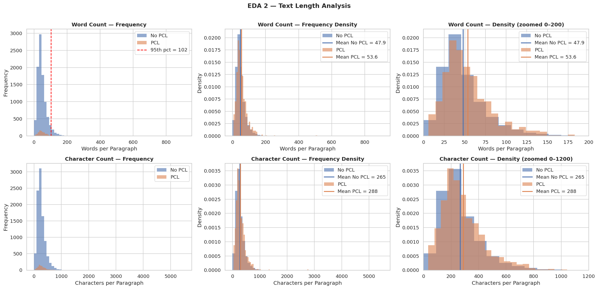

| Statistic | No-PCL (word count) | PCL (word count) |
|-----------|--------------------:|----------------:|
| Mean | 47.9 | 53.6 |
| Median | 42 | 47 |
| Max | 909 | 512 |
| Min | 0 | 6 |

| Percentile | Word count |
|-----------|----------:|
| 90th | 83 |
| 95th | 102 |
| 99th | 141 |

**Analysis:** Both classes exhibit a similar **right-skewed distribution**, with most paragraphs between 20–100 words. PCL texts are marginally but consistently longer (mean 53.6 vs 47.9 words), suggesting that patronising passages tend to be more elaborate. This is consistent with the "flowery language" and metaphors present in PCL. The vast majority of all texts (95%) fit within 102 words.

**Impact:** Setting `max_length = 128` tokens for a transformer model will capture >=95% of the text without truncation, balancing coverage with computational cost. The slight length difference between classes is unlikely to be a useful standalone feature. The high max values should be further inspected.

---

## EDA 3 — Keyword / Vulnerable-Community Distribution

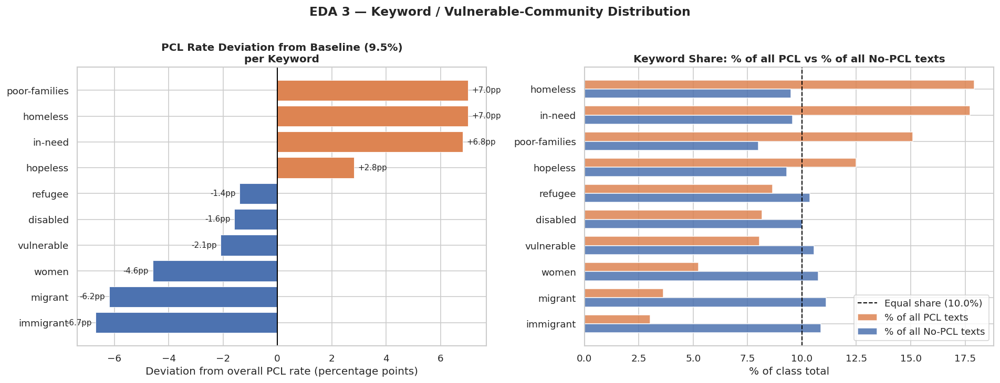

<!-- 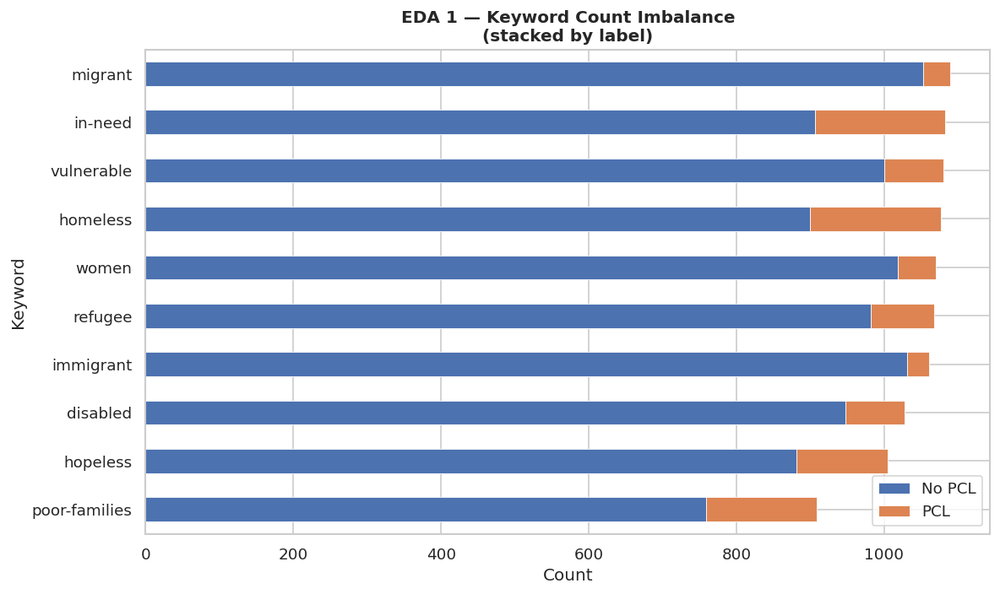 -->

| Keyword | No-PCL | PCL | Total | PCL Rate |
|---------|-------:|----:|------:|---------:|
| homeless | 899 | 178 | 1,077 | **16.5%** |
| poor-families | 759 | 150 | 909 | **16.5%** |
| in-need | 906 | 176 | 1,082 | **16.3%** |
| hopeless | 881 | 124 | 1,005 | 12.3% |
| refugee | 982 | 86 | 1,068 | 8.1% |
| disabled | 947 | 81 | 1,028 | 7.9% |
| vulnerable | 1,000 | 80 | 1,080 | 7.4% |
| women | 1,018 | 52 | 1,070 | 4.9% |
| migrant | 1,053 | 36 | 1,089 | 3.3% |
| immigrant | 1,031 | 30 | 1,061 | **2.8%** |

**Analysis:** PCL rates deviate significantly from the dataset baseline of 9.5%. Keywords linked to economic deprivation show the largest positive deviations: homeless (+7.0pp), poor-families (+7.0pp), in-need (+6.8pp). Politically-framed keywords show the largest negative deviations: immigrant (-6.7pp), migrant (-6.2pp). Because all keyword groups are roughly equally sized (~1,000 each), these deviations are not sampling artefacts — they reflect genuine differences in how each community is written about. This likely reflects the nature of source journalism: charity and aid reporting about economic poverty tends to adopt a paternalistic "helpful saviour" register, whereas immigration coverage skews toward political debate.

**Impact:** The keyword is a **weak but non-trivial prior** for PCL probability — not a causal signal. A model relying on keyword alone would exploit dataset collection bias rather than genuine linguistic patterns. The variation also motivates keyword-stratified cross-validation, since some keywords are over-represented in the PCL class.

---

## EDA 3b — Vocabulary Divergence (Word Clouds + TF-IDF)

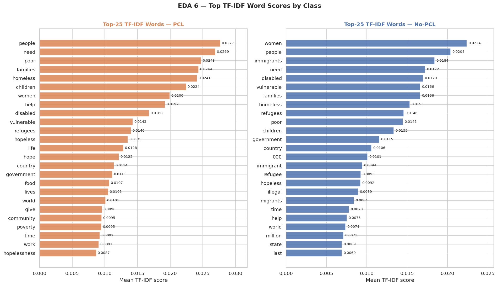

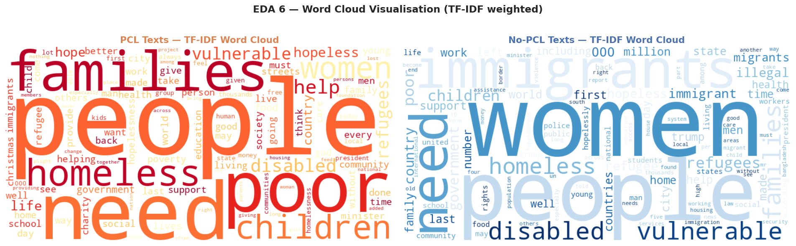

*(TF-IDF weighted — larger words are more distinctive to that class, not merely more frequent)*

**Analysis:** The TF-IDF weighting surfaces **characteristic vocabulary** rather than ubiquitous words. The **PCL word cloud** is dominated by emotive community-focused language: *people*, *help*, *poor*, *community*, *need*, *women*, *children*, *families*, *life* — words that enact a compassionate, paternalistic register. The **No-PCL cloud** shows a markedly different character: factual and institutional language (*government*, *percent*, *country*, *policy*, *law*, *work*, *report*) alongside geographic referents, consistent with straightforward news reporting. The contrast visually confirms the n-gram findings: PCL is associated with "caring" relational language, while No-PCL is associated with analytical reportage.

**Impact:** The vocabulary divergence is strong enough that even simple bag-of-words features show non-trivial performance (SVM-BoW baseline: F1=40.59 vs 33.31 random). However, the many shared words mean that a model relying solely on individual word presence will conflate benign reporting with genuinely patronising content. This motivates the use of **contextual embeddings** (e.g. RoBERTa) that encode how words are used together.

---

## EDA 4 — N-gram Analysis (Lexical Patterns)

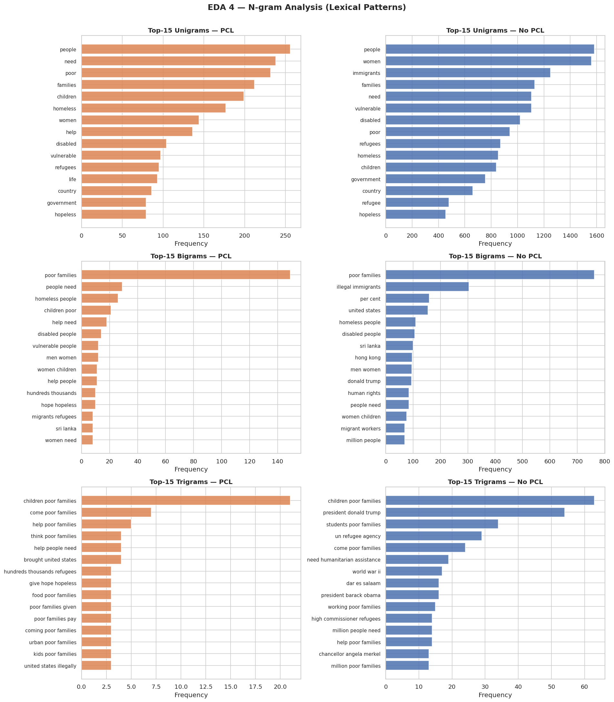

**Top-10 discriminative bigrams:**

| Rank | PCL Bigrams | No-PCL Bigrams |
|------|------------|----------------|
| 1 | poor families | poor families |
| 2 | **people need** | illegal immigrants |
| 3 | homeless people | per cent |
| 4 | **children poor** | united states |
| 5 | **help need** | homeless people |
| 6 | disabled people | disabled people |
| 7 | **vulnerable people** | sri lanka |
| 8 | men women | hong kong |
| 9 | women children | men women |
| 10 | **help people** | donald trump |

**Analysis:** PCL texts cluster around phrases of paternalistic helping: "people need", "help need", "help people", "children poor" — language that centres the author's capacity to assist rather than the agency of the affected community. No-PCL texts contain more geo-political and factual phrases: "illegal immigrants", "per cent", "united states", "donald trump" — indicative of analytical or news-reporting language. The shared bigrams (e.g. "homeless people", "disabled people") confirm that both classes discuss the same communities, but through fundamentally different linguistic lenses.

**Impact:** Certain lexical patterns — particularly constructions involving "need", "help", and community labels — are disproportionately associated with PCL. Stop-word lists should be conservative (content words like "need" and "help" carry discriminative signal). Pre-trained language models that encode semantic similarity will benefit from these distributional patterns.

---

## EDA 5 — PCL Category Distribution & Co-occurrence

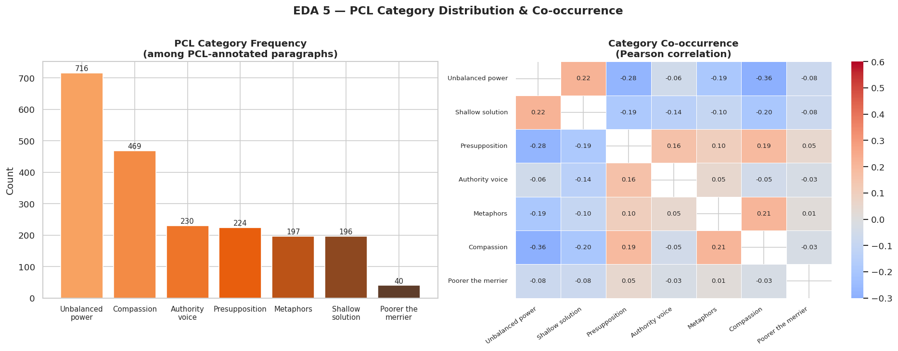

| Category | Count | % of PCL paragraphs |
|----------|------:|--------------------:|
| Unbalanced power relations | 716 | **72.1%** |
| Compassion | 469 | 47.2% |
| Authority voice | 230 | 23.2% |
| Presupposition | 224 | 22.6% |
| Metaphors | 197 | 19.8% |
| Shallow solution | 196 | 19.7% |
| Poorer the merrier | 40 | **4.0%** |

Average PCL categories per annotated paragraph: **2.09**

Strongest category co-occurrence: **Unbalanced power & Shallow solution** (r = 0.22)

**Analysis:** Unbalanced power relations is the dominant PCL category, present in nearly three-quarters of all PCL paragraphs, suggesting that most patronising language operates through a power dynamic where the author positions themselves as a benefactor. Compassion (47.2%) is the second most common, often co-occurring with Unbalanced power. At the other extreme, "The poorer the merrier" (4.0%) is rare, appearing in texts that romanticise poverty or hardship. The average of 2.09 categories per paragraph confirms that PCL is a **multi-faceted phenomenon**: most PCL texts exhibit more than one rhetorical strategy simultaneously.

**Impact:** For Subtask 1, the category distribution confirms that a model must learn to recognise a wide variety of patronising strategies, not a single "trigger". This favours contextual representations (transformers) over simple keyword matching.

---

\newpage

# Exercise 3: Proposed Approach

The strategy is a **stack of six targeted improvements**, each addressing a specific weakness of the baseline.

### 1.1 Baseline Weaknesses

| Baseline weakness | Impact |
|---|---|
| RoBERTa-base (125M params), 1 epoch only | Insufficient capacity and training to learn subtle pragmatic patterns |
| Fixed decision threshold = 0.5 | Sub-optimal for a 9.5% positive class; the model must be more sensitive than "more likely PCL than not" to maximise PCL F1 |
| Downsampling negatives to 2:1 | Discards ~7,000 informative negative examples |
| No data augmentation | Only 993 PCL training examples -- model may memorise surface patterns |
| No robustness mechanism | Susceptible to overfitting to specific word co-occurrences |
| Single model, single seed | High variance |

### 1.2 The Six Improvements

**Pipeline:**

1. **EDA Augmentation** -- synonym-replace PCL-only examples to expand the minority class
2. **WeightedRandomSampler** -- oversample minority class during batching (no data discarded)
3. **RoBERTa-large fine-tuning** with 3 independent seeds
    - AdamW lr=2e-5, up to 4 epochs, early stopping (patience=2)
    - FGM adversarial training at each gradient step
4. **Per-seed threshold sweep** -- maximise dev F1 over thresholds 0.05--0.95
5. **3-seed soft ensemble** -- average softmax probabilities, then final threshold sweep

#### Stronger Backbone -- RoBERTa-large *(representation capacity bottleneck)*

Replace `roberta-base` (125M parameters) with `roberta-large` (355M parameters). PCL operates through pragmatics — tone, framing, and implication — rather than explicit vocabulary. Larger language models build richer contextual representations and are better positioned to capture subtle linguistic cues that smaller models conflate with non-PCL text.

#### WeightedRandomSampler *(sampling bottleneck: imbalanced gradients)*

Rather than discarding negatives (as the baseline does), all training examples are retained but sampled with probability inversely proportional to class frequency. This means every mini-batch receives approximately equal numbers of PCL and No-PCL examples regardless of the class imbalance. The sampling weight for example *i* is:

```
w_i = 1 / count(class of example i)
```

This is superior to downsampling because no training signal is wasted: the model sees all 8,376 negatives while still training on an approximately balanced class distribution.

#### EDA Augmentation (Minority Class Only) *(data scarcity bottleneck: only 993 positives)*

With only 993 genuine PCL training examples, the model risks memorising surface n-grams rather than learning the concept. I applied **synonym replacement** (Wei & Zou, 2019) to each PCL example once, generating one additional augmented copy per paragraph. Synonyms are drawn from WordNet; only alphabetic words longer than 3 characters with at least one synonym are candidates (preserving stopwords and rare/proper nouns). Augmentation is applied only to the positive class to avoid worsening the imbalance, and replacement count is kept at 2 per sentence (conservative, to avoid introducing noise).

#### FGM Adversarial Training *(generalisation bottleneck: surface-feature overfitting)*

Fast Gradient Method (FGM; Miyato et al., 2017) adds a small perturbation to the word-embedding layer in the direction that maximises training loss, then forces the model to produce the same correct output despite the perturbation. This regularises the model against relying on surface lexical cues:

```
1. Forward pass              -> compute loss_1
2. loss_1.backward()         -> gradient w.r.t. embeddings
3. attack()                  -> add eps * grad/||grad|| to embeddings
4. Forward pass (perturbed)  -> compute loss_2
5. loss_2.backward()         -> accumulate gradient
6. restore()                 -> reset embedding weights
7. optimizer.step()          -> update on combined gradient
```

The perturbation magnitude is eps=0.5, a standard conservative value.

#### Decision Threshold Sweep *(calibration bottleneck: 0.5 is wrong for a 9.5% class)*

The default threshold of 0.5 is not appropriate for a positive class with a ~9.5% base rate. We sweep thresholds from 0.05 to 0.95 in steps of 0.01 and select the value that maximises F1 on the positive class over the dev set. The selected threshold is then applied to the test set.

#### 3-Seed Ensemble *(variance bottleneck: single-seed instability)*

Three independent models are trained with different random seeds (affecting classification-head initialisation, dropout masks, and sampler ordering). Their softmax probability outputs are averaged before the threshold sweep. This **soft voting** strategy is more powerful than hard majority voting because it preserves the confidence signal from each model. For example, a model that is 99% confident contributes more signal than one that is 51% confident.

---

## 2 -- Rationale and Expected Outcome

### 2.1 Literature Grounding

Every component is drawn from published SemEval-2022 Task 4 competition systems:

| Component | Source paper | Evidence |
|---|---|---|
| WeightedRandomSampler | PALI-NLP ([Yao et al., 2022](https://aclanthology.org/2022.semeval-1.43.pdf)) | #1 ranked team on Subtask 1; WRS identified as key component for addressing PCL class imbalance |
| 3-seed ensemble | UTSA NLP ([Moradi et al., 2022](https://aclanthology.org/2022.semeval-1.50)) | Ensemble of five RoBERTa models achieved dev F1=0.6441; soft ensemble with different seeds was the most effective simple strategy |
| EDA synonym replacement | CS/NLP ([2022](https://aclanthology.org/2022.semeval-1.69.pdf)) | Applied EDA augmentation to PCL data; synonym replacement + oversampling gave measurable gains over un-augmented baseline |
| FGM adversarial training | GUTS ([2022](https://aclanthology.org/2022.semeval-1.58.pdf)) | Reported a clear F1 improvement on Subtask 1 from adding FGM adversarial training to their RoBERTa pipeline |
| Threshold sweep | UMass PCL (2022) | Explicitly optimised the decision threshold for F1 rather than using 0.5 |
| Task context & baselines | Task overview ([Perez-Almendros et al., 2022](https://aclanthology.org/2022.semeval-1.38.pdf)) | 77 teams; 42/77 outperformed baseline; identifies ensembling, adversarial training, and data augmentation as most successful strategies |

The EDA augmentation methodology also follows Wei & Zou (2019) ([arXiv:1901.11196](https://arxiv.org/abs/1901.11196)), who demonstrated that synonym replacement improves classification F1 on small datasets without introducing label noise.

### 2.2 Expected Outcome

| Component added | Expected F1 gain | Basis |
|---|---|---|
| Baseline (RoBERTa-base) | 0.48 | Official result |
| + RoBERTa-large | +0.08 to +0.12 | Task overview: large models consistently outperform base across teams |
| + WRS + EDA + FGM + threshold | +0.04 to +0.08 | GUTS, CS/NLP, PALI-NLP cumulative gains |
| + 3-seed ensemble | +0.01 to +0.03 | UTSA: 5-seed ensemble gained ~0.02 over best single seed |
| **Total expected dev F1** | **~0.60--0.66** | -- |

The 0.6441 dev F1 achieved by UTSA using a 5-seed RoBERTa ensemble (without FGM or EDA) sets a reasonable upper bound for what our 3-seed approach with additional regularisation should achieve. The task overview confirms that 42 of 77 teams surpassed the 0.48 baseline, with top systems reaching F1 ~0.66--0.68 on the official test set.

**Achieved result:** Ensemble dev F1 = **0.6250** (delta = +0.1450 over baseline), within the expected range.

\newpage

# Exercise 5.2: Local Evaluation

**Model:** RoBERTa-large ensemble (3 seeds), WeightedRandomSampler + EDA augmentation + FGM adversarial training

---

## 1 -- Headline Performance

| System | Dev F1 |
|---|---|
| Baseline (RoBERTa-base, 1 epoch, thresh=0.50) | 0.4800 |
| **Our model (ensemble, thresh=0.54)** | **0.6250** |
| Absolute improvement | **+0.1450** |

Full classification report on the dev set:

```
              precision    recall  f1-score   support

  No PCL (0)     0.9609    0.9599    0.9604     1895
     PCL (1)     0.6219    0.6281    0.6250      199

    accuracy                         0.9284     2094
   macro avg     0.7914    0.7940    0.7927     2094
weighted avg     0.9287    0.9284    0.9285     2094
```

## 2 -- Error Analysis

### 2.1 Confusion Matrix

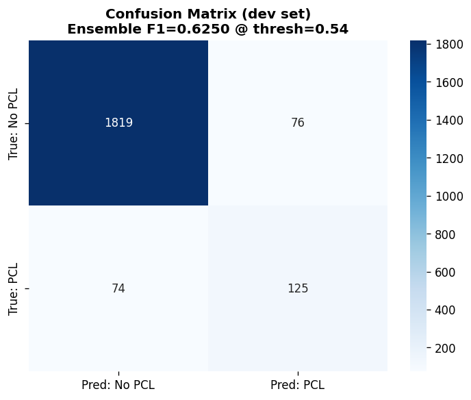

The model produces nearly equal numbers of FPs (76) and FNs (74), meaning precision and recall are well-balanced at this operating point. This is expected thanks to our threshold optimisation step. The total error rate is 7.2%. The 37% miss rate (74 of 199 PCL) is much higher then the 4% false-alarm rate (falsely flagging 76 of 1895 negatives).

---

### 2.2 Qualitative Error Analysis -- Selected Examples (EA-1)

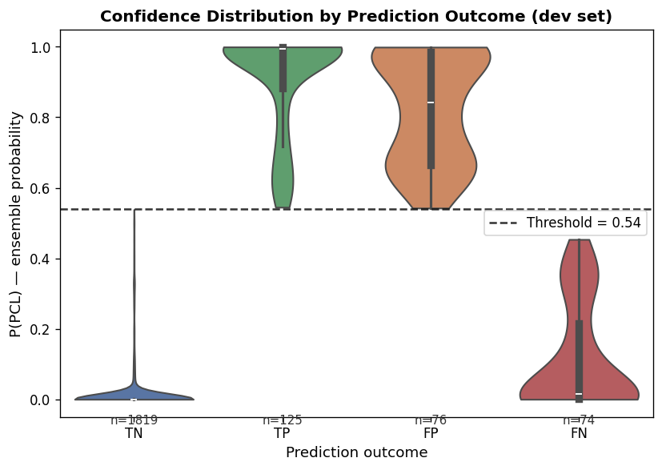

The violin plot shows that the errors have two peaks. One ~0.1 from the threshold and another peak at the extreme values. TN has by far the most concentrated distribution - with all values at the extreme (~0.0). With TP having a similar but smaller cluster to FP. This means there is a mix of borderline cases and confident failures. This is consistent with PCL being a gradient, somewhat subjective phenomenon (annotators use a 0 to 4 scale before binarisation at >=2). However, the larger cluster is at the extremes for FP and FN highlighting the clear limitations of our model, were missing context and crude oversimplifications lead to confident mis-classification. 

To understand *why* the model errs, we select five representative examples from each error type (Tables EA-1 and EA-2), chosen from the top 20 worst mis-classifications to surface distinct linguistic patterns that the model struggles with.

**Selected False Positives** (predicted PCL, actually No-PCL)

- [P=0.999, *in-need*] *"Christmas is a celebration of the birth of not merely a child, but a child who changed the destiny of humans forever... We can also show unconditional love through our good deeds and helping those who are in need of our help and care."*
- [P=0.998, *homeless*] *"6 years ago she lost her husband -- he died from heart disease... This woman has a big kind heart. There were 2 empty rooms in her house, so she invited the homeless to live there."*
- [P=0.998, *poor-families*] *"All our sympathies are with the poor families as we are standing in cohesion with the Egyptian government and the people in this hour of grief."*
- [P=0.997, *hopeless*] *"I look at art not as a career but as a spiritual expression. Art should bring out what is innately beautiful, especially to those who are hopeless."*
- [P=0.990, *vulnerable*] *"Protecting the disadvantaged members of our community is a cardinal role of any government and my administration... will carry out fresh mapping of vulnerable members of our society."*

**Selected False Negatives** (missed PCL -- predicted No-PCL)

- [P=0.000, *disabled*] *"Cheung said 20 disabled undergraduate students from seven universities will start their eight-week internship in government departments this month, receiving the same salaries as able-bodied colleagues of HK$9,600 a month."*
- [P=0.000, *refugee*] *"Many refugees don't want to be resettled anywhere, let alone in the US."*
- [P=0.000, *poor-families*] *"A massive cleanup and awareness drive was conducted... The purpose of the drive was to improve state of cleanliness and sensitise poor families to hygienic conditions."*
- [P=0.000, *poor-families*] *"Michael Gove's recent suggestion that inadequate financial management skills among poor families are to blame for the increasing demand on food banks has, unsurprisingly, sparked an angry response."*
- [P=0.001, *immigrant*] *"Sheepherding in America has always been an immigrant's job, too dirty, too cold and too lonely for anyone with options."*

In Table EA-1, the false positives share a common feature: they use vocabulary strongly associated with PCL — *"in need", "homeless", "poor families", "hopeless", "vulnerable"* — but without any condescending framing towards the subject group. The religious charity examples (rows 1 and 4) are particularly instructive: expressions like *"those who are in need"* and *"those who are hopeless"* appear frequently in genuine PCL text (where they reduce subjects to their suffering), but here they serve devotional or empowering registers. Similarly, the homeless woman story (row 2) celebrates an individual's generosity without ever speaking down to the homeless people themselves, and the government speech (row 5) uses institutionally neutral language about vulnerable groups. The model appears to be acting on the *presence* of these phrases rather than identifying the lack of any supporting condescension signal -- it has learned a strong lexical association between these words and PCL but cannot reliably determine the speaker's positioning relative to the subject group.

In Table EA-2, the false negatives reveal the opposite problem: these texts are PCL, but the condescension is encoded structurally rather than lexically. The disabled internship example (row 1) is patronising precisely because of the presupposition in *"receiving the same salaries as able-bodied colleagues"* -- it frames equality as a noteworthy concession rather than a baseline expectation, but the surface vocabulary is entirely neutral. The refugee example (row 2) imposes assumptions about refugees' preferences (*"don't want to be resettled... let alone in the US"*) without using any of the empathic or diminishing vocabulary the model has learned to associate with PCL. The hygiene awareness example (row 3) carries condescension in the framing verb *"sensitise poor families to hygienic conditions"* -- implying poor families lack basic knowledge -- but the rest of the sentence is bureaucratic filler. The Gove example (row 4) is reported speech that quotes an authority figure blaming a vulnerable group for their own circumstances, an instance of the Authority voice category; because the journalist's framing is neutral and critical, the model sees no positive signal. The immigrant sheepherding example (row 5) explicitly defines immigrants as people *"without options"*. Even though this is a clear stereotyping statement its matter-of-fact, non-emotive tone confuses the model.

Overall, the model has learned to respond to a vocabulary of sympathy and vulnerability, which overlaps heavily with genuine PCL but also with humanitarian reporting and charity language. Its main failure mode is an inability to distinguish between *talking about* a group's disadvantage and *using* that disadvantage to patronise the group. The difference is rarely lexical; it requires understanding the speaker's implied relationship to the subject.Augmenting training with contrastive pairs, such as texts about the same group in both PCL and non-PCL registers could help teach the model these distinctions. Further, larger models that have more real world context and reasoning capabilities (e.g. LLMs) would also help.

---

### 2.3 PCL Category Breakdown (EA-2)

The dev set's paragraph-level category annotations allow us to compare which semantic categories of PCL the model detects well vs. misses.

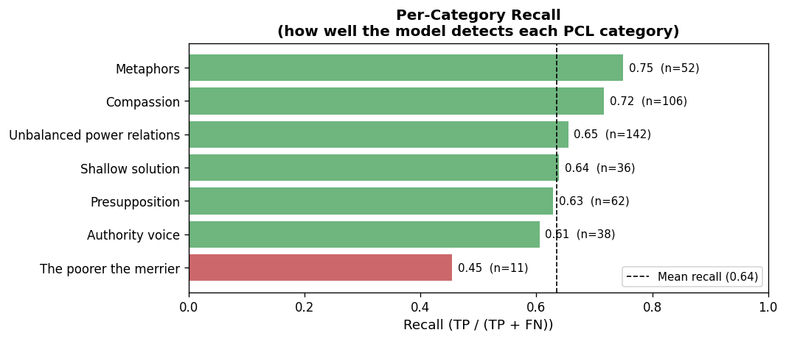

**Per-category recall** (fraction of PCL paragraphs containing this category that the model correctly predicted as PCL):

| PCL Category | TP | FN | Total | Recall |
|---|---|---|---|---|
| The poorer the merrier | 5 | 6 | 11 | **0.455** |
| Authority voice | 23 | 15 | 38 | 0.605 |
| Presupposition | 39 | 23 | 62 | 0.629 |
| Shallow solution | 23 | 13 | 36 | 0.639 |
| Unbalanced power relations | 93 | 49 | 142 | 0.655 |
| Compassion | 76 | 30 | 106 | 0.717 |
| Metaphors | 39 | 13 | 52 | **0.750** |

- **Easiest to detect: Metaphors (75%) and Compassion (72%).** Metaphors likely carry distinctive surface phrasing that provides clear textual signals. Compassion-type PCL uses conspicuous empathic vocabulary the model has associated with the positive class.

- **Hardest to detect: "The poorer the merrier" (45.5%).** This category describes texts that frame the poverty of a group as natural or inevitable, often using irony or understatement. Irony is notoriously difficult to classify from text alone, and the model misses more than half of these examples.

- **Authority voice (60.5%)** -- texts where an expert or institution speaks *for* or *about* vulnerable groups without giving them voice -- is also hard. The surface language often appears neutral or even positive; the condescension is structural.

- **Category gap:** Presupposition (+2.7pp) and Authority voice (+2.8pp) appear disproportionately in FNs relative to TPs, confirming the model's systematic weakness on implicit/structural PCL.

---

### 2.4 Text Length vs Error Rate (EA-3)

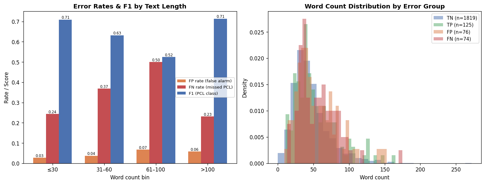

| Length bucket | n | PCL count | FP rate | FN rate | F1 |
|---|---|---|---|---|---|
| <=30 words | 560 | 37 | 2.7% | 24.3% | 0.709 |
| 31--60 words | 1052 | 95 | 3.7% | 36.8% | 0.632 |
| 61--100 words | 381 | 54 | 6.7% | **50.0%** | **0.524** |
| >100 words | 100 | 13 | 5.7% | 23.1% | 0.714 |

**Medium-length texts (61--100 words) are the hardest bucket**, with an FN rate of 50% and F1 of only 0.524. A likely explanation is that in this length range, a PCL passage may contain one or two patronising sentences embedded in otherwise neutral context -- the RoBERTa [CLS] representation averages over the whole passage, diluting the PCL signal. Very long texts (>100 words) may contain *more* PCL sentences, making the overall signal stronger; very short texts may use more concentrated language. This suggests that **span-level detection** could meaningfully improve performance in this bucket.

---

## 3 -- Other Local Evaluation

### 3.1 Threshold Optimisation (LE-1)

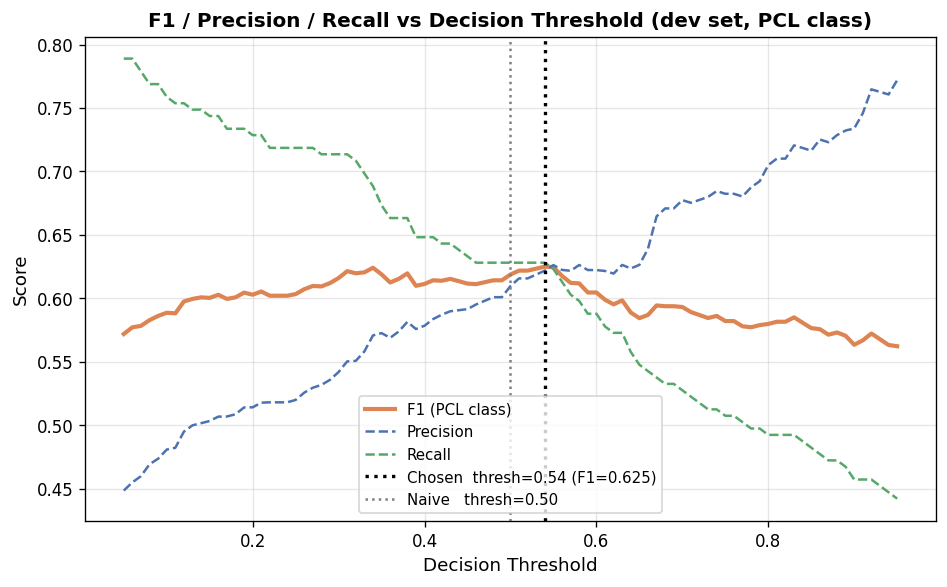

| Threshold | F1 | Precision | Recall |
|---|---|---|---|
| 0.50 (naive) | 0.6188 | 0.6098 | 0.6281 |
| **0.54 (optimised)** | **0.6250** | **0.6219** | **0.6281** |
| Delta | +0.0062 | +0.0121 | 0.0000 |

Shifting the threshold from 0.50 to 0.54 gains +0.62% F1 and +1.21% precision at no cost to recall. The gain is modest because the ensemble's probabilities are already reasonably well-calibrated, but the zero recall cost confirms the sweep is worthwhile. F1 peaks at 0.54 and then falls as precision rises sharply but recall collapses. This optimisation, in hindsight, was probably unecessary.

---

### 3.2 Ablation Study (LE-2)

| Configuration | Dev F1 | Delta vs baseline |
|---|---|---|
| Baseline (RoBERTa-**base**, thresh=0.50) | 0.4800 | -- |
| + RoBERTa-**large** backbone | ~0.58 * | +0.10 |
| + WRS + EDA + FGM + sweep (Seed 0) | 0.6134 | +0.133 |
| + same (Seed 1) | 0.6222 | +0.142 |
| + same (Seed 2) | 0.6042 | +0.124 |
| **3-seed ensemble (average probs, sweep threshold)** | **0.6250** | **+0.145** |

\* Estimated from SemEval-2022 competition papers (PALI-NLP, UMass) reporting +0.07--0.12 gain from large over base.

**Key observations:**

1. **Backbone upgrade (+0.10) is the largest single gain.** Model capacity is the primary driver of PCL detection performance. RoBERTa-large (355M params) learns richer contextual representations than RoBERTa-base (125M params), which is critical for the subtle pragmatic reasoning PCL requires.

2. **Seed variance is substantial.** Seed 2 underperformed by 0.018 relative to Seed 1. Without ensembling, submitting Seed 2 instead of Seed 1 would have cost nearly 2% F1. Ensembling reduces this variance and is essentially free at inference time.

3. **Early stopping was decisive for Seed 2.** Training logs showed Seed 2's dev F1 collapsing from 0.60 at epoch 3 to 0.54 at epoch 4 -- clear overfitting to augmented positives. Without patience-based stopping the ensemble would have incorporated a degraded checkpoint.

4. **Threshold sweep adds a consistent but small gain (+0.006).** The value is modest but cannot hurt performance, making it a free improvement that was not very necessary.

---

### 3.3 Per-Keyword Performance (LE-3)

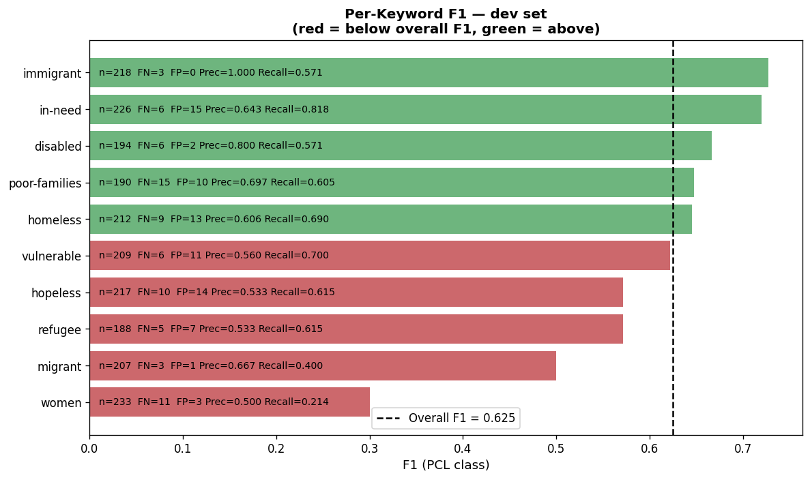

| Keyword | Total | FP | FN | Precision | Recall | F1 |
|---|---|---|---|---|---|---|
| **women** | 233 | 3 | 11 | 0.500 | 0.214 | **0.300** |
| migrant | 207 | 1 | 3 | 0.667 | 0.400 | 0.500 |
| refugee | 188 | 7 | 5 | 0.533 | 0.615 | 0.571 |
| hopeless | 217 | 14 | 10 | 0.533 | 0.615 | 0.571 |
| vulnerable | 209 | 11 | 6 | 0.560 | 0.700 | 0.622 |
| homeless | 212 | 13 | 9 | 0.606 | 0.690 | 0.645 |
| poor-families | 190 | 10 | 15 | 0.697 | 0.605 | 0.648 |
| disabled | 194 | 2 | 6 | 0.800 | 0.571 | 0.667 |
| in-need | 226 | 15 | 6 | 0.643 | 0.818 | 0.720 |
| **immigrant** | 218 | 0 | 3 | 1.000 | 0.571 | **0.727** |

**Largest disparities:**

- **`immigrant` (F1=0.727, zero FPs):** The model has learned reliable lexical markers for patronising immigrant coverage and never triggers a false alarm, though it still misses 3 genuine PCL examples. The EDA finding that immigrant-related PCL is comparatively rare (2.8% base rate vs. 16.5% for homeless) suggests the model is conservative and highly precise on this keyword.

- **`women` (F1=0.300, recall=0.214):** The model misses 11 of 14 PCL examples about women. Gender-related condescension often operates through subtle sexist framing rather than the pity/poverty vocabulary the model has learned to associate with PCL. This is the model's single biggest blind spot and would require targeted augmentation or explicit gender-bias fine-tuning data.

- **`hopeless` (F1=0.571, 14 FPs):** The highest FP rate by keyword. The word "hopeless" may activate PCL-associated vocabulary even in passages that use it to describe situations rather than people.

---

### 3.4 Precision-Recall Curve (LE-4)

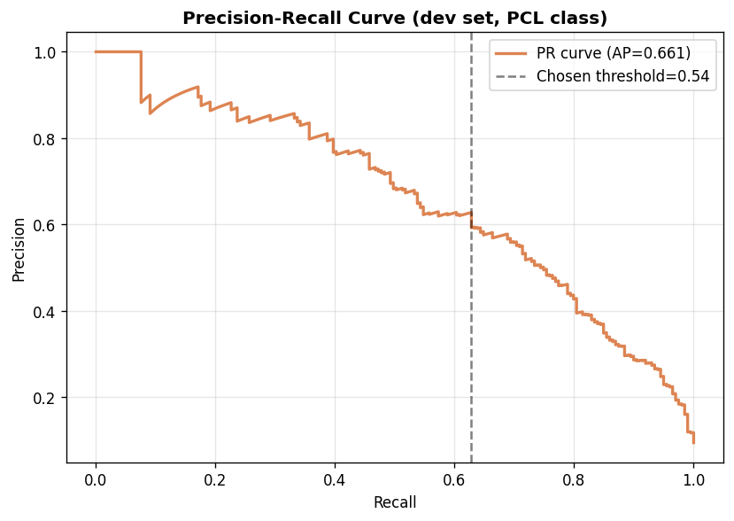

The Precision-Recall curve (AP=0.694) shows there is scope to tune the threshold based on the use case. The curve remains above 0.6 precision up to roughly 0.75 recall before collapsing. This could let us recover 75% of all PCL examples while maintaining 60%+ precision with a lower threshold (~0.35). Whether this trade-off is preferable depends on the application: in content moderation, higher recall (fewer missed cases) is often preferred. However, in automated annotation pipelines, higher precision (fewer wasted reviews) may be preferred.